# ai-devops를 사용한 AI 개발 시나리오 가이드

## 시나리오 소개 
  ai-devops를 활용한 ai 개발 시나리오는 아래와 같이 5가지로 나누어 제공하고 있다.
  1. Kubeflow-fairing 라이브러리를 활용한 분산 트레이닝 및 서빙 시나리오
  2. Tekton을 활용한 ML pipeline 생성 시나리오
  3. KServe를 활용한 Multi model serving 시나리오
  4. KALE 기본 시나리오
  5. KALE을 활용한 분산 학습 시나리오

  **참고** 각 시나리오의 디렉토리로 들어가면 해당 시나리오 수행에 필요한 자세한 정보를 확인할수 있다.

### 시나리오에 활용한 AI-DEVOPS 컴포넌트 버전 정보  
  - katib v0.14.0
  - kserve v0.8.0
  - knative-serving v1.2.5
  - training-operator v1.5.0
  - notebook-controller b0.2.8
  - profile-controller v1.6.1
  - cluster-local-gateway v1.14.1
---

### 작업을 위한 namespace 및 notebook 생성(1~3번 시나리오 공통 사항)
  - 4,5번 시나리오는 각 시나리오별 가이드를 참고하여 생성한다.
  1. Profile 생성 
  - ai-devops에서는 작업하려는 namespace를 profile이라는 crd를 통해 관리한다.
  - ai-devops 기능을 사용하기 위한 role, rolebinding등의 k8s리소스 배포 뿐만아니라 istio-injection 활성화와 같은 작업을 자동으로 진행한다.
  - UI의 Import YAML 버튼을 활용하여 demo profile을 생성한다. 
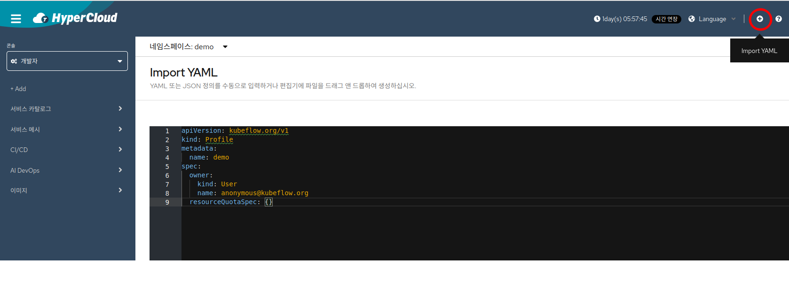 
  - 참고 : [0.profile.yaml](./0.profile.yaml)

  2. Authorizationpolicy 생성
  - profile을 이용하여 ns를 생성하면 자동으로 해당 네임스페이스에 authorizationpolicy가 배포되는데 해당 rbac로는 시나리오 진행시 403 error가 발생하는 경우가 있으므로 UI의 Import YAML 버튼을 활용하여 아래의 authorizationpolicy를 배포한다.
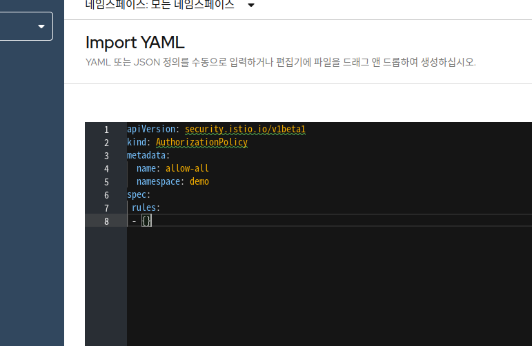 
  - 참고 : [1.authorizationpolicy.yaml](./1.authorizationpolicy.yaml)  

  3. Notebook 생성
  - ai-devops에서는 ML Model 코딩을 위한 web 기반의 python IDE인 JupyterNotebook을 사용할 수 있다.
  - 아래 그림과 같이 노트북 서버를 생성한다.

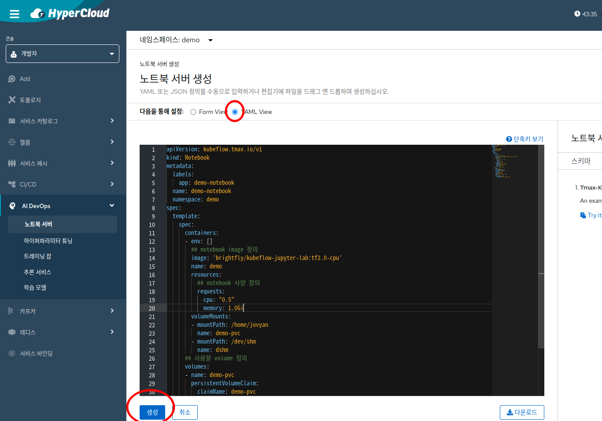
  - 참고 : [1.notebook.yaml](./1.notebook.yaml)
  - 폐쇄망 환경의 경우 : [1.notebook_closednw.yaml](./1.notebook_closednw.yaml)
    * 폐쇄망 환경의 경우에는 1.notebook_closednw.yaml 파일의 image registry 부분을 수정한다.(필수)

*시나리오에서는 여러 커스텀 패키지가 포함된 custom jupyterNotebook image를 사용하였다. (brightfly/kubeflow-jupyter-lab:tf2.0-cpu)

*폐쇄망 환경의 경우 시나리오에서 사용되는 파이썬 패키지가 포함되어 있고 fairing 코드가 수정된 custom jupyterNotebook image를 사용하였다. (tmaxcloudck/kubeflow-jupyter-lab:v0.1)

  - 정상적인 배포를 확인하기 위해, action->connect 버튼을 눌러 jupyter진입을 확인하자.

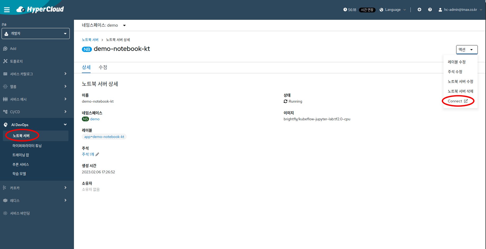

  - notebook 접속이 정상적으로 완료되면 필요한 파일을 다운로드한 후 1~3번 시나리오를 진행한다.

### 참고1. 리소스 개별 생성 및 상태 조회
  - 1~2번 시나리오에서는 experiment, tfjob, isvc와 같은 개별 리소스를 노트북 서버 내 ipynb을 run하여 생성된 pipelinerun yaml 파일을 배포하여 생성하거나, kubeflow-fairing 라이브러리의 deployer 등을 이용하여 배포하고 있다. 또한 리소스 상태 조회도 client를 통해 노트북 서버에서 진행하고 있다.
  - 각 리소스의 생성이나 상태 조회를 개별적으로 진행하고 싶다면 다음과 같이 하이퍼클라우드 콘솔을 이용한다.

  1. hyper-parameter tuning을 위한 Katib 사용하기 (하이퍼파라미터 튜닝 메뉴)
  - hyper-parameter란 ML 모델 학습에 필요한 컨트롤 변수로, learningRate, dropoutRate, batchSize, optimizer, neuralNetworkLayerNumber 등이 있다.
  - Katib를 통해 hyper-parameter 값들에 따른 모델 학습의 정확도(Accuracy)를 알 수 있으며, 본격적인 모델 학습에 이 값들이 사용된다.
  - 예시에는 살펴볼 hyper-parameter로 learningRate, batchSize를 설정하였다.
  - 아래 그림과 같이 katib experiment를 생성한다.

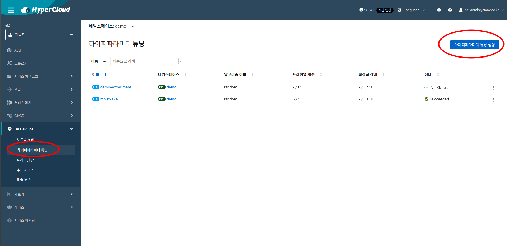
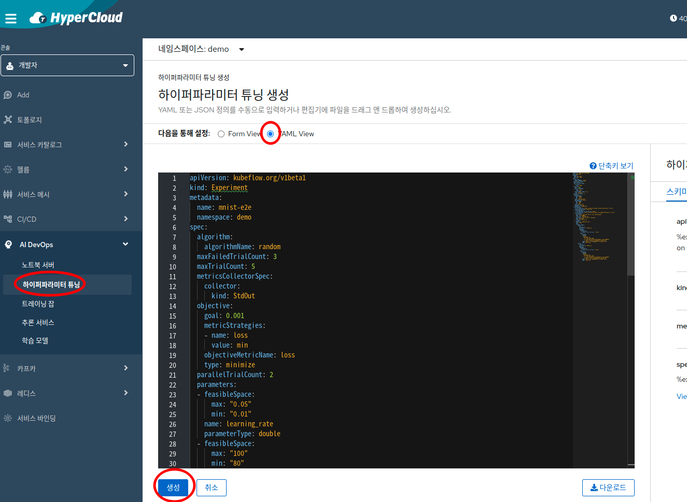
  - 참고 : [3.katib-experiment.yaml](3.katib-experiment.yaml)
  - 모든 작업이 완료된다면, 하이퍼파라미터 튜닝 탭에서 생성한 experiment 상태를 확인할 수 있으며, 개별 리소스를 클릭후 수정 탭으로 들어가면 status 항목에서 ML 모델의 정확도가 가장 높은 hyper-parameter를 조회할수 있다.
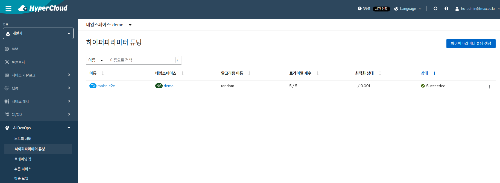
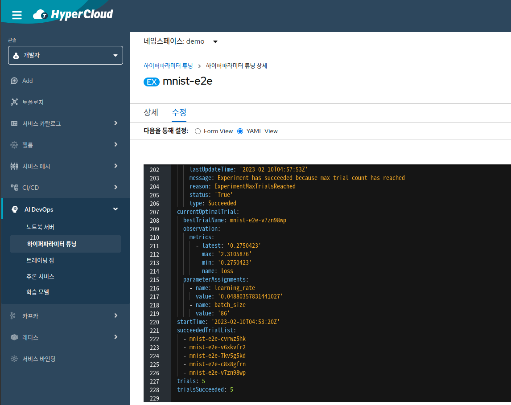  

  2. Model 학습을 위한 TFJob 생성하기 (트레이닝잡) 메뉴)
  - hyper-parameter 탐색까지 끝났다면, 본격적인 Model 학습을 위해 tfJob을 생성한다.
  - Step 3에서 도출된 learningRate와 batchSize를 사용하여 모델을 학습한다. (learningRate 0.04880357831441027, batchSize 86)
  - 위의 값을 tfjob chief와 worker container args로 입력한 후, 아래 그림과 같이 tfjob을 생성한다. 

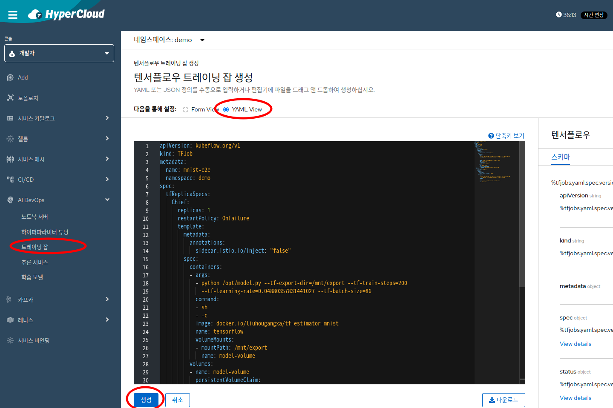
  - 참고 : [4.tfjob.yaml](4.tfjob.yaml)
  - 학습이 종료되면, 설정한 pvc에 모델이 저장된다. 
  - 하이퍼파라미터 튜닝 예시와 같이 리소스 상태도 콘솔 화면에서 조회 가능하다.

  3. Model 서빙을 위한 Kserve 사용하기 (추론서비스 메뉴)
  - 실제 운영에 쓰일 model을 기반으로 server를 만들고, inference service를 제공한다.
  - 위 단계에서 PVC에 저장된 모델을 이용하여 아래 그림과 같이 추론 서비스를 생성한다.

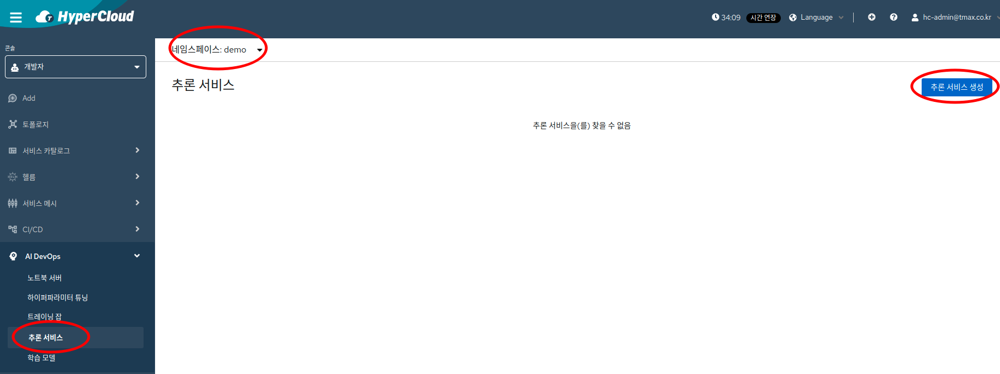
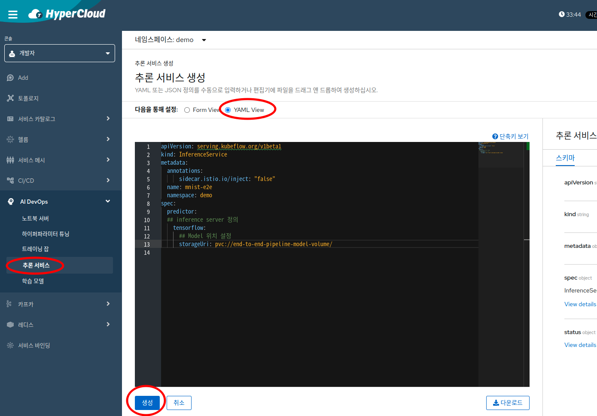
  - 참고 : 다음 두가지 스키마로 추론서비스 배포가 가능하다. [5.kserve-inferenceservice.yaml](5.kserve-inferenceservice.yaml), [5.kserve-inferenceservice-2.yaml](5.kserve-inferenceservice-2.yaml) 
  - 하이퍼파라미터 튜닝 예시와 같이 리소스 상태도 콘솔 화면에서 조회 가능하다.

*istio-ca-root-cert configmap을 찾지 못하는 에러가 뜬다면, istiod pod를 재부팅하고 진행하며 생성한 모든 리소스를 삭제하고 다시 시도하자.
  

### 참고2. 로컬 개발 환경의 docker registry 인증정보 사용
 - docker에 로그인 되어있는 로컬 개발환경에서 config.json을 복사하여, jupyterNotebook container에 붙여넣는다.
 - 보통 docker registry 인증정보는 로컬개발환경 /root/.docker/config.json 파일을 찾을 수 있다. ( 안나온다면 다음의 위치를 본다. ${HOME}/.docker/config.json )
 - jupyterNotebook에서 터미널을 열어 /home/jovyan/.docker/config.json으로 복사하자

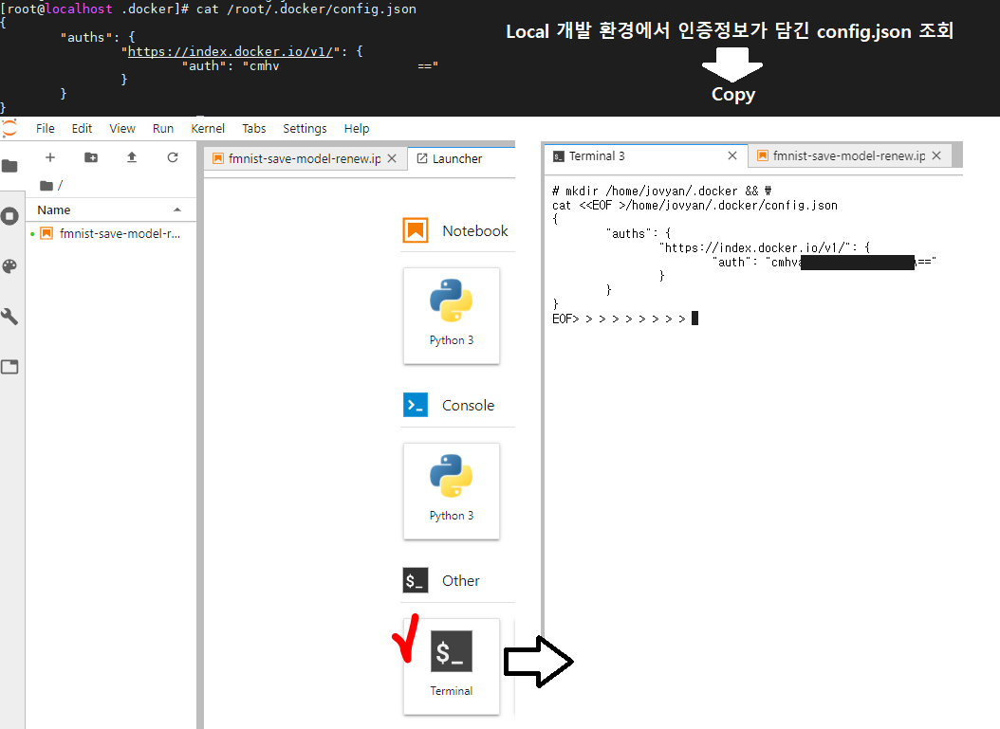

